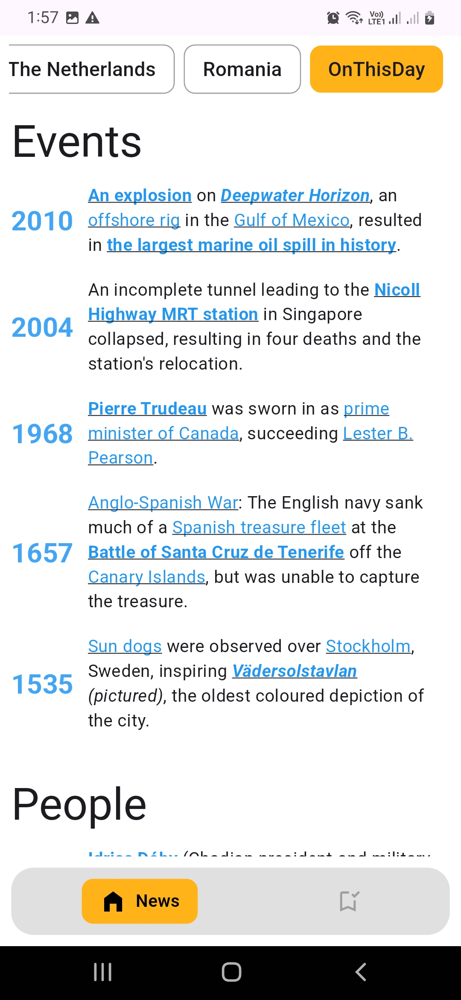

# Kagi News App

A native-feeling modern Flutter app that displays the latest news articles categorized from [Kagi's Kite News API](https://kite.kagi.com). This app is designed with user experience, scalability, and performance in mind.

## Table of Contents

- [🚀 Features](#-features)
- [🔧 Tech Stack](#-tech-stack)
- [📦 Project Setup](#-project-setup)
- [📲 App Installation](#-app-installation)
- [🛠️ System Architecture](#️-system-architecture)
- [🔀 Screen Flow Diagram](#-screen-flow-diagram)
- [🎥 Screen Recording](#-screen-recording)
- [📸 Screenshots](#-screenshots)

## 🚀 Features

- ✅ Fetch and display news categories dynamically
- ✅ Show news lists per category
- ✅ Category can be selected and news of that category will be displayed
- ✅ News detail screen
- ✅ News bookmark feature which is stored in local storage
- ✅ Bookmarked news list and bookmark management screen
- ✅ Support Offline feature by caching all API data in local storage
- ✅ Native UI feel using platform-aware widgets and animations
- ✅ Responsive UI for Android & iOS
- ✅ Flutter's clean code architecture
- ✅ Unit and widget tests included

## 🔧 Tech Stack

- **Flutter** (Channel stable, 3.27.3)
- **Dart**
- **Provider** (for state management and routing)
- **Dio** (for HTTP requests)
- **go_router** (for navigation routing)
- **get_it** (for dependency injection)
- **hive** (for local NoSQL database)
- **url_launcher** (for launching url in external browser)
- **flutter_html** (for load html content in flutter widget)
- **intl** (for datetime calculation)
- **cached_network_image**
- **flutter_svg**
- **flutter_test**
- **mockito** (for mocking behavior in test)
- **flutter_launcher_icons** (for chaning app default icon)
- **flutter_lints**
- **build_runner** (for auto generation of boilerplate code)

## 📦 Project Setup

1. Clone the Repo

```bash
git clone https://github.com/SudiptaAChy/kagi-news-app.git
cd kagi-news-app
```

2. Install Dependencies

```bash
flutter clean
flutter pub get
```

3. Run on a specific device using flutter devices and `flutter run -d <device_id>`
4. Run all test code

```bash
flutter test
```

## 📲 App Installation

Download the app from below link: \
[apk](https://portal.testapp.io/apps/install/mzyOmL5n5QZKy)

## 🛠️ System Architecture

The app is developed using **MVVM Repository pattern** architecture


## 🔀 Screen Flow Diagram


## 🎥 Screen Recording

[▶️ Watch Demo Video on Google Drive](https://drive.google.com/file/d/1SVuCXZPU3tD7dalc39baoVRh4Tth20WJ/view?usp=sharing)

## 📸 Screenshots

<table>
<caption>News Screen</caption>
  <tr>
    <td></td>
    <td></td>
    <td></td>
    <td></td>
  </tr>
</table>
<table>
<caption>News Details Screen</caption>
  <tr>
    <td></td>
    <td></td>
    <td></td>
    <td></td>
  </tr>
  <tr>
    <td></td>
    <td></td>
  </tr>
</table>
<table>
<caption>Bookmark Screen</caption>
  <tr>
    <td></td>
    <td></td>
  </tr>
</table>
